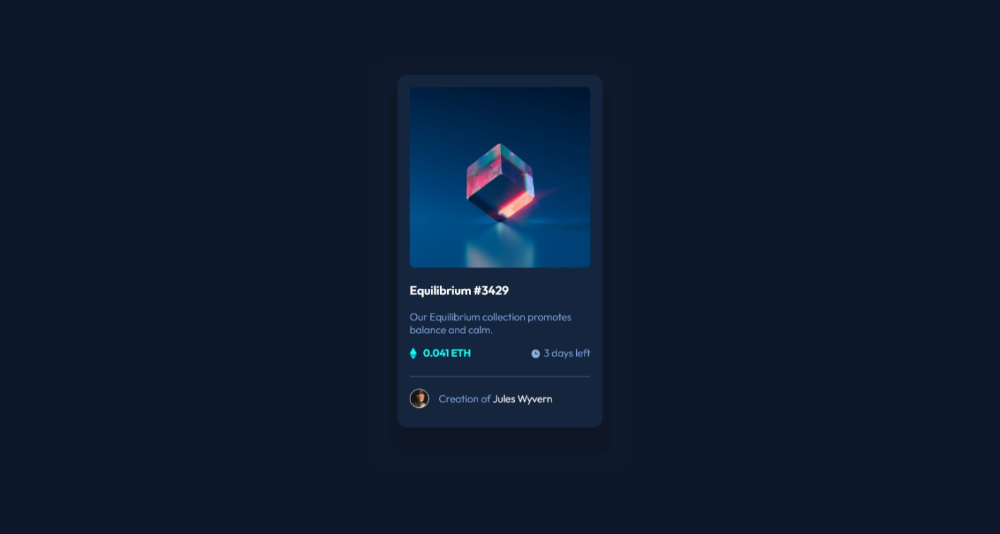
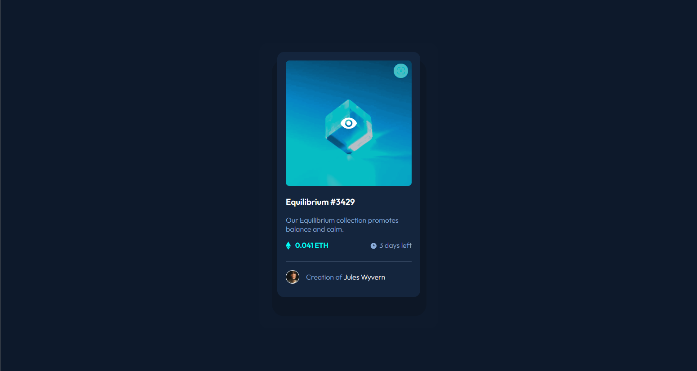

# Frontend Mentor - NFT preview card component solution

This is a solution to the [NFT preview card component challenge on Frontend Mentor](https://www.frontendmentor.io/challenges/nft-preview-card-component-SbdUL_w0U). Frontend Mentor challenges help you improve your coding skills by building realistic projects. 

## Table of contents

- [Overview](#overview)
  - [The challenge](#the-challenge)
  - [Screenshot](#screenshot)
  - [Links](#links)
- [My process](#my-process)
  - [Built with](#built-with)
  - [What I learned](#what-i-learned)
  - [Useful resources](#useful-resources)
- [Author](#author)

## Overview

### The challenge

Users should be able to:

- View the optimal layout depending on their device's screen size
- See hover states for interactive elements

### Screenshot




### Links

- Solution URL: [Add solution URL here](https://www.frontendmentor.io/solutions/nft-card-lAXe3Dk8vJ)
- Live Site URL: [Live Site](https://abdoomar01.github.io/nftcard/)

## My process

### Built with

- Semantic HTML5 markup
- CSS custom properties
- Flexbox

### What I learned

The most challenging thing was getting the eye picture to show on top of the image, and getting the image to have this sort of blue hue

```css
.container .images:hover {
    cursor: pointer;
}

.container .images:hover > img:nth-of-type(1) {
    opacity: 0.7;
    filter: sepia(100%) saturate(2000%) hue-rotate(180deg) brightness(200%);
    cursor: pointer;
}

.container .images:hover > img:nth-of-type(2) {
    display: initial;
}
```

### Useful resources

- [CSSmatic](https://www.cssmatic.com/box-shadow) - This helped me getting the box shadow right.


## Author

- Frontend Mentor - [@abdoOmar01](https://www.frontendmentor.io/profile/abdoOmar01)